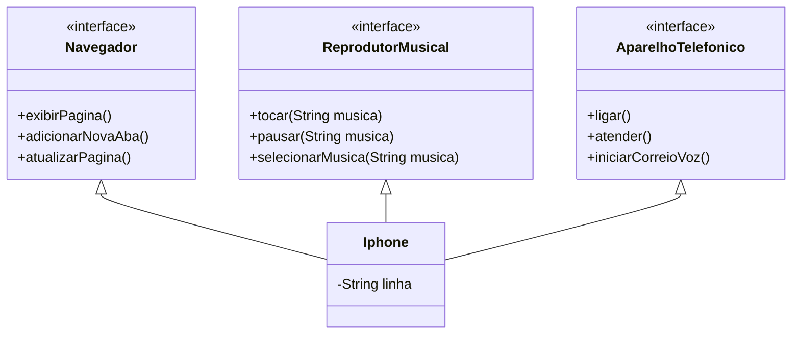

## STBC - Santander Bootcamp 2024 ☕♨️.

### Sobre o Repositório:
Desafio de Código sobre Diagramação e conceitos de Programação Orientada a Objetos, como Classes, Interfaces e suas particularidades.

